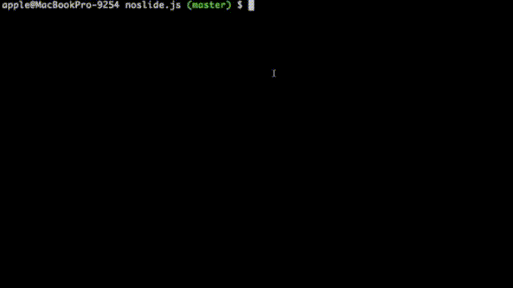

# Install

```bash
git clone https://github.com/crazyguitar/noslide.js
cd noslide.js
npm install
```

# Demo




# How to create a slide

```js
var Slides = require('./slide')
  , theme = require('./themes/Ptt');


const slide = 'slides/example.md'

let noslide = new Slides(slide, theme);
noslide.render();
```
